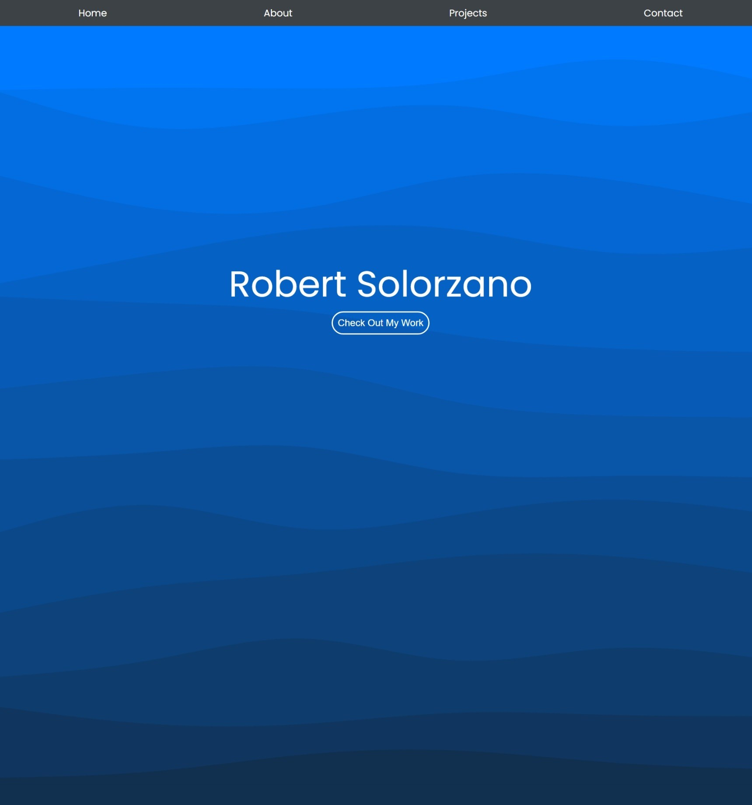

# Portfolio

My ever-growing and always-updating Portfolio is a reflection of my ongoing tech journey. 
 
I'll be dropping more projects in the future, so stay tuned!

## Link
Link: [Robert Solorzano's Portfolio](https://robertsolorzano.github.io/Portfolio/)

## Preview

## Credits

**Sources for Studying, CSS Styles, Style icons, and Svg content:**

[SVG Waves BG Generator](https://wickedbackgrounds.com/app)

[Boxicons](https://boxicons.com/)

[CSS Gradient](https://cssgradient.io/)

[Google Fonts](https://fonts.google.com/)

[CSS flexible box layout](https://developer.mozilla.org/en-US/docs/Web/CSS/CSS_Flexible_Box_Layout)

[CSS Margin](https://www.w3schools.com/css/css_margin.asp)

[Markdown Cheat Sheet](https://www.markdownguide.org/cheat-sheet/)

## License

Please refer to the LICENSE in the repo.